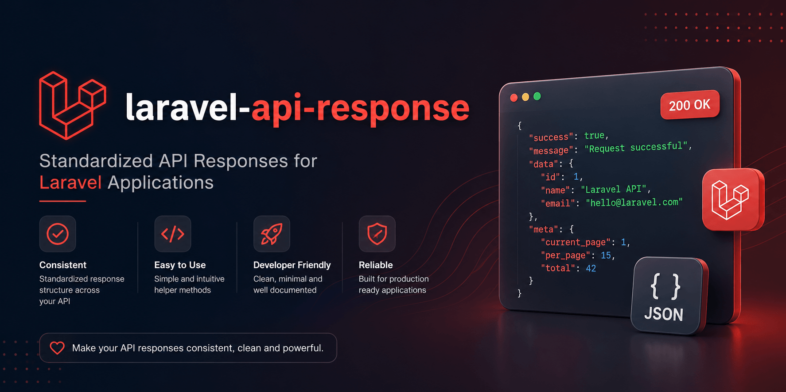

# Laravel API Response

Consistent JSON API response helpers for Laravel applications.

<div align="center">



[](https://github.com/satheez/laravel-api-response/actions/workflows/tests.yml)
[](https://packagist.org/packages/satheez/laravel-api-response)
[](https://packagist.org/packages/satheez/laravel-api-response)
[](https://www.php.net)
[](https://laravel.com)
[](LICENSE.md)

</div>

Laravel API Response wraps every JSON response in a standard
`{ success, message, data, errors, meta }` envelope. Helper functions, a
facade, response macros, and a fluent builder give you multiple ways to produce
the same consistent output from controllers, jobs, middleware, or anywhere in
your application.

The package is intentionally small and does not manage routing, authentication,
or business logic. It formats the response body that moves through those layers.

## Highlights

- Return success and error responses with a single method call.
- Standard `{ success, message, data, errors, meta }` envelope on every response.
- Wrap `JsonResource`, `ResourceCollection`, and paginated results automatically.
- Build complex responses step by step with the fluent builder.
- Use the `api_response()` helper, `api()` shortcut, `ApiResponse` facade, or `Response::` macros.
- Add static or dynamic root-level fields to every response.
- Localize default messages via Laravel translation files.
- Opt in to automatic exception rendering for common Laravel exceptions.
- Configure macro names, collision behavior, and exception exposure.

## Requirements

| Requirement | Version |
| --- | --- |
| PHP | `^8.3` |
| Laravel | `^12.0` or `^13.0` |

## Installation

```bash
composer require satheez/laravel-api-response
```

Optionally publish the config and translations:

```bash
php artisan vendor:publish --tag="api-response-config"
php artisan vendor:publish --tag="api-response-translations"
```

See [Installation](docs/installation.md) for the full setup flow.

## Quick Start

```php
use App\Http\Requests\StoreUserRequest;
use App\Http\Resources\UserResource;
use App\Models\User;
use Illuminate\Http\JsonResponse;

final class UserController
{
    public function store(StoreUserRequest $request): JsonResponse
    {
        $user = User::query()->create($request->validated());

        return api_response()->created(
            data: new UserResource($user),
            message: 'User created successfully.',
        );
    }

    public function show(User $user): JsonResponse
    {
        return api_response()->success(new UserResource($user));
    }

    public function destroy(User $user): JsonResponse
    {
        $user->delete();

        return api_response()->deleted();
    }
}
```

Equivalent response styles:

```php
api_response()->success(['status' => 'ok']);   // Helper
api()->error('Invalid request');                // Shorter alias
ApiResponse::created(['id' => 1]);              // Facade
Response::success(['status' => 'ok']);           // Macro
response()->error('Invalid request');            // Macro via helper
```

## Response Envelope

Every response uses the same base structure:

```json
{
    "success": true,
    "message": "Request completed successfully.",
    "data": null,
    "errors": null,
    "meta": []
}
```

## Available Methods

| Method | Status | Purpose |
| --- | ---: | --- |
| `success($data, $message, $status, $headers, $meta)` | Custom | General success response |
| `created($data, $message, $headers, $meta)` | 201 | Resource created response |
| `updated($data, $message, $headers, $meta)` | 200 | Resource updated response |
| `stored($data, $message, $headers, $meta)` | 200 | Alias for updated/stored responses |
| `deleted($data, $message, $headers, $meta)` | 200 | Resource deleted response |
| `error($message, $status, $errors, $headers, $meta)` | Custom | General error response |
| `validationError($errors, $message, $headers, $meta)` | 422 | Validation error response |
| `unauthorized($message)` | 401 | Unauthenticated response |
| `forbidden($message)` | 403 | Unauthorized action response |
| `accessDenied($message)` | 403 | Alias for forbidden responses |
| `notFound($message)` | 404 | Missing resource response |
| `invalidRequest($message)` | 400 | Bad request response |
| `somethingWentWrong($message)` | 500 | Server error response |
| `exception($exception, $message, $status)` | Custom | Exception response |
| `resource($resource, $message, $status, $headers, $meta)` | Custom | JSON resource response |
| `collection($collection, $resourceClass, $message, $status, $headers, $meta)` | Custom | Resource collection response |
| `paginated($paginator, $resourceClass, $message, $status, $headers, $meta)` | Custom | Paginated resource response |

## Documentation

| Guide | Covers |
| --- | --- |
| [Installation](docs/installation.md) | Composer install, publishing config and translations, verifying setup |
| [Usage guide](docs/usage.md) | All response methods, fluent builder, resources, pagination, response envelope |
| [Configuration](docs/configuration.md) | Messages, extra fields, resolvers, macros, and exception config options |
| [Architecture](docs/architecture.md) | Core classes, response flow, macro registration, and exception rendering pipeline |
| [Errors and exception rendering](docs/errors.md) | Error helpers, exception mappings, JSON-only rendering, message exposure |
| [Macros](docs/macros.md) | Macro registration, collision behavior, custom names, disabling macros |
| [Examples and recipes](docs/examples.md) | CRUD controller, validation, pagination, dynamic extra fields, fluent builder |
| [FAQ](docs/faq.md) | Common questions about envelope shape, config caching, API versioning, and more |
| [Upgrade guide](docs/upgrade.md) | Migrating from `satheez/api-response` to `satheez/laravel-api-response` |

## Contributing

See [CONTRIBUTING.md](CONTRIBUTING.md) for local setup, coding standards, and
pull request guidelines.

## Changelog

All notable changes are documented in [CHANGELOG.md](CHANGELOG.md).

## Testing This Package

```bash
composer test
composer test-coverage
composer analyse
composer format-test
```

## License

Laravel API Response is open-sourced software licensed under the
[MIT license](LICENSE.md).
