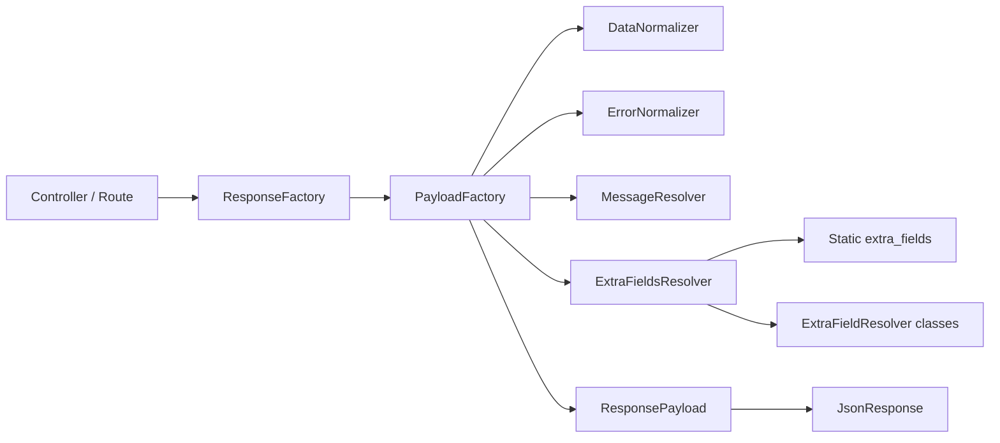
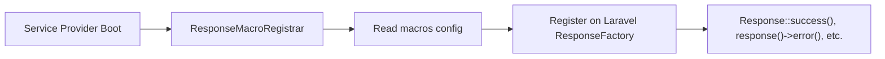
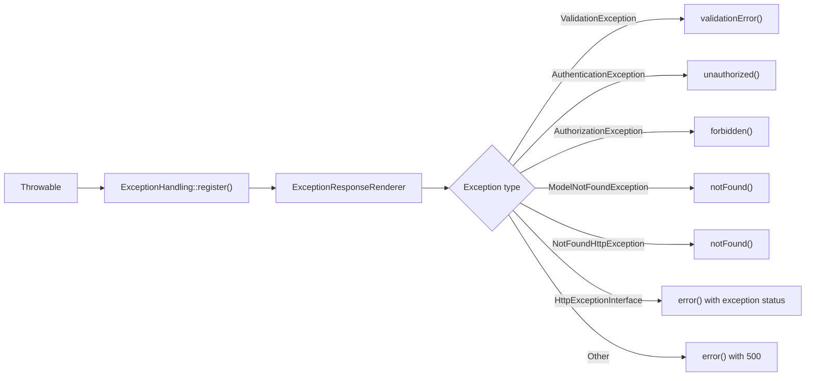

# Architecture

Laravel API Response is built around a small set of stateless, readonly classes.
The package does not manage routing, authentication, or business logic. It
provides a standardized envelope for JSON API responses.

## Core Components

| Component | Responsibility |
| --- | --- |
| `ResponseFactory` | Entry point for all response methods. Delegates to `PayloadFactory`. |
| `PayloadFactory` | Assembles the `ResponsePayload` from normalized data, errors, messages, and extra fields. |
| `ResponseBuilder` | Fluent builder for constructing responses step by step. |
| `DataNormalizer` | Converts mixed data (arrays, models, resources, collections) into JSON-safe structures. |
| `ErrorNormalizer` | Normalizes errors from arrays, `MessageBag`, or `ValidationException` into a consistent array. |
| `MessageResolver` | Resolves response messages from config keys, translation keys, or literal strings. |
| `ExtraFieldsResolver` | Resolves static and dynamic extra fields, enforcing reserved-key and type constraints. |
| `ResponseMacroRegistrar` | Registers package methods as macros on Laravel's response factory at boot. |
| `ExceptionResponseRenderer` | Maps common Laravel exceptions to appropriate error responses. |
| `ExceptionHandling` | Static entry point for registering exception rendering in `bootstrap/app.php`. |

## Data Objects

| Class | Purpose |
| --- | --- |
| `ResponsePayload` | Immutable DTO holding the assembled response body. Converts to array via `toArray()`. |
| `ResponseContext` | Immutable DTO passed to extra field resolvers. Contains the full response state and the current `Request`. |
| `ErrorBag` | Lightweight wrapper around the normalized error array. |

## Contracts

| Interface | Purpose |
| --- | --- |
| `ExtraFieldResolver` | Implemented by resolver classes to provide dynamic root-level fields. |

## Exceptions

| Exception | When Thrown |
| --- | --- |
| `InvalidConfigurationException` | Malformed config: non-string keys, reserved field overrides, non-cacheable extra field values, invalid macro config. |
| `InvalidResolverException` | Resolver class does not exist or does not implement `ExtraFieldResolver`. |
| `MacroRegistrationException` | Macro config references a method that does not exist on `ResponseFactory`. |

## Response Flow

> **Note:** This document contains Mermaid diagrams. If they do not render in
> your markdown viewer, you can view this file on GitHub.

1. Your controller calls a method on `ResponseFactory` (e.g., `success()`,
   `created()`, `error()`).
2. `ResponseFactory` delegates to `PayloadFactory`, passing the success flag,
   status, message, data, errors, meta, and headers.
3. `PayloadFactory` normalizes data and errors, resolves the message, builds a
   `ResponseContext`, and resolves extra fields.
4. The assembled `ResponsePayload` is converted to an array and returned as a
   Laravel `JsonResponse`.

## Macro Registration Flow

When the service provider boots, `ResponseMacroRegistrar` reads the macro
configuration and registers each configured method as a macro on Laravel's
response factory. This enables `Response::success()` and `response()->error()`
style calls.

## Exception Rendering Flow

Exception rendering is opt-in. When registered, `ExceptionResponseRenderer`
matches the exception type and delegates to the appropriate `ResponseFactory`
method, producing a consistent JSON envelope for all error conditions.

## Service Provider

The package uses `spatie/laravel-package-tools`. The service provider:

1. Publishes `config/api-response.php` under the `api-response-config` tag.
2. Publishes translation files under the `api-response-translations` tag.
3. Registers `ResponseFactory` as a singleton aliased to `api-response`.
4. Boots `ResponseMacroRegistrar` to register response macros.

---

**Previous:** [Configuration](configuration.md) | **Next:** [Errors and exception rendering](errors.md)
